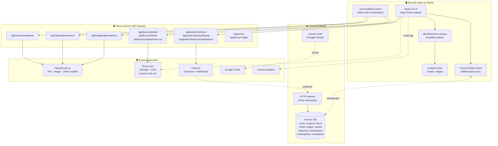
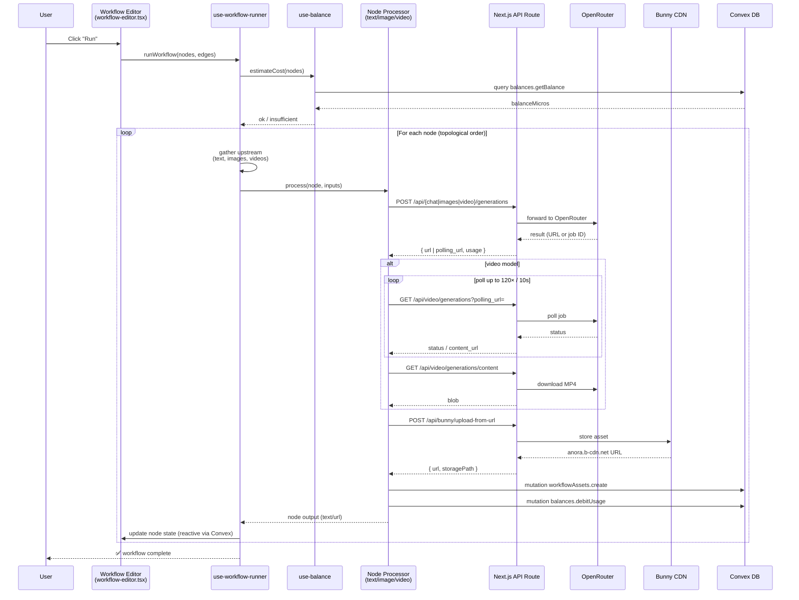
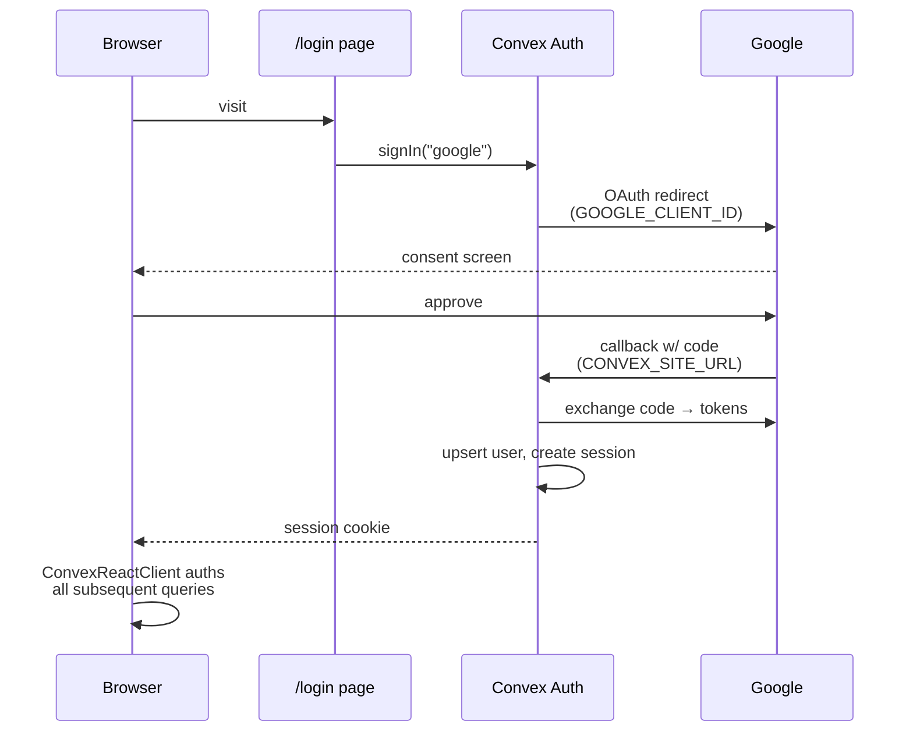
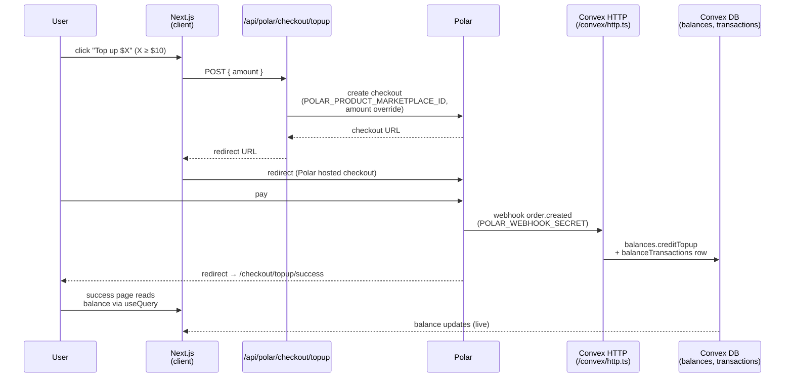
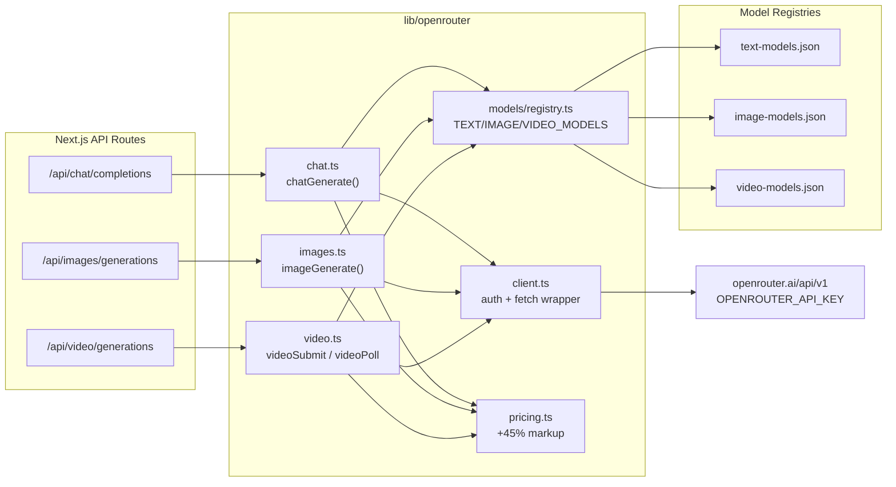
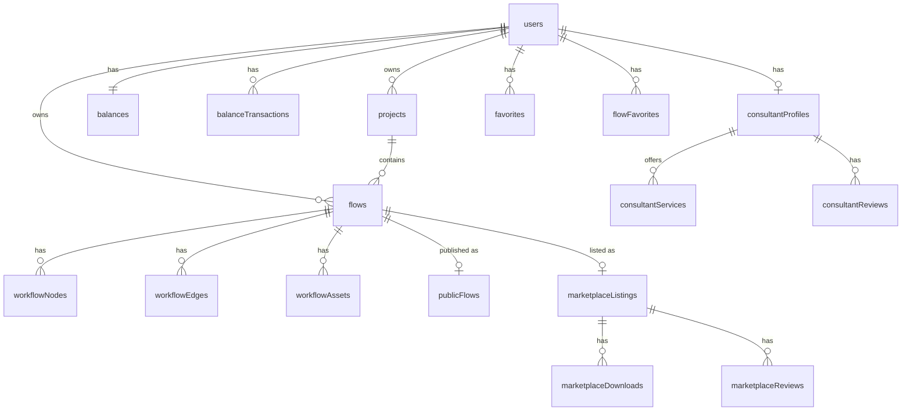

# ANORA Labs — Infrastructure Architecture

End-to-end architecture for the ANORA Labs workflow builder: a Next.js app on top of Convex, OpenRouter, Bunny CDN, and Polar.sh.

---

## 1. High-Level System Architecture



**Key properties**

- Workflow execution is **client-driven** — the browser walks the node graph and calls API routes one node at a time.
- Persistence is **real-time reactive** — every flow/node/edge/balance change flows through Convex's WebSocket sync. No manual refetching.
- AI traffic is **unified through OpenRouter** — `lib/openrouter/*` is the only external AI surface. Image, video, and chat all use the same client.
- File storage is **Bunny CDN** under a structured path: `users/{userId}/flows/{flowId}/{type}/{nodeId}/{filename}`.
- Billing is **prepaid micro-credit** — `balances.balanceMicros` is debited per generation, topped up via Polar checkouts, audited in `balanceTransactions`.

---

## 2. Tech Stack Summary

| Layer | Technology | Key Files |
|-------|-----------|-----------|
| Framework | Next.js 16 (App Router) | `app/layout.tsx`, `next.config.ts` |
| Canvas | `@xyflow/react` 12 | `app/workflow/components/workflow-editor.tsx` |
| Client state | Zustand + `subscribeWithSelector` | `app/workflow/store/app-store.ts` |
| Database | Convex | `convex/schema.ts` |
| Auth | Convex Auth + Google OAuth | `convex/auth.ts`, `app/ConvexClientProvider.tsx` |
| AI routing | OpenRouter.ai | `lib/openrouter/*` |
| File storage | Bunny Storage + CDN | `lib/bunny/storage.ts`, `app/api/bunny/*` |
| Payments | Polar.sh | `app/api/polar/*`, `convex/polar.ts`, `convex/http.ts` |
| UI primitives | Radix UI + shadcn/ui | `components/ui/*` |
| Forms + validation | React Hook Form + Zod | marketplace forms |
| Analytics | Umami (self-hosted script) | `app/layout.tsx` |
| Layout engine | ELK | `app/workflow/hooks/use-layout.tsx` |

---

## 3. Workflow Execution Flow (Client-Side Orchestrator)

When the user clicks **Run** on a flow, the orchestrator walks the DAG in topological order and dispatches one processor per node.



**Notes**

- The Next.js server is a thin pass-through for AI calls — it adds the `OPENROUTER_API_KEY` and shapes the response. No heavy logic.
- Cost debiting happens **after** each successful generation, not up-front. `use-balance` only blocks the run if pre-estimated cost > current balance.
- All generated assets are **re-hosted on Bunny** so OpenRouter's signed/temporary URLs don't break later (see `/api/bunny/upload-from-url`).

---

## 4. Authentication Flow



- Provider config in `convex/auth.ts` / `convex/auth.config.ts`.
- `useConvexAuth()` gates protected layouts (`app/(dashboard)/layout.tsx`, `app/workflow/layout.tsx`).
- Convex Auth issues session cookies — there is no JWT to manage on the client.

---

## 5. Billing & Marketplace Payment Flow

Polar.sh is the only payment provider. Top-ups and marketplace purchases share **one** Polar product (ad-hoc priced) — the amount is set per checkout.



**Marketplace purchases** follow the same shape via `/api/polar/checkout/marketplace`, but the success handler also writes a `marketplaceDownloads` row and forks the published flow into the buyer's account.

**Usage debits**

- Every successful generation writes a `balanceTransactions` row (`kind: "usage"`) and decrements `balances.balanceMicros`.
- Pricing comes from `lib/openrouter/pricing.ts`. Markup is **45%** over OpenRouter's base rate, stored as **micro-USD** integers (1 USD = 1,000,000 micros) so no floating-point drift.

---

## 6. AI Provider Routing (OpenRouter)



**Routing variants**

- `:nitro` suffix → OpenRouter picks fastest provider at runtime.
- `:free` variants → free-tier models.
- `/auto` model → OpenRouter chooses the model for text generations.
- Image/video model IDs may have **mode-specific subfields** (`model.text`, `model.image`, `model.video`) that the processor resolves before sending to OpenRouter.

---

## 7. File Storage Path Convention (Bunny)

All assets land in a deterministic path so they can be GC'd by flow or by user:

```
anora.b-cdn.net/
└── users/
    └── {userId}/
        └── flows/
            └── {flowId}/
                ├── image/{nodeId}/{filename}.png
                ├── video/{nodeId}/{filename}.mp4
                ├── cover/{filename}.jpg      ← flow cover image
                └── profile/{filename}.jpg    ← consultant avatar etc.
```

Uploaded via three routes:

- `POST /api/bunny/upload` — direct multipart upload from browser.
- `POST /api/bunny/upload-from-url` — server-side fetch of an external URL (used to re-host OpenRouter outputs).
- `POST /api/bunny/delete` — single-asset deletion.

---

## 8. Convex Schema Overview



See `convex/schema.ts` for the full table definitions and indices.

---

## 9. Environment Variables

| Variable | Purpose | Scope |
|----------|---------|-------|
| `NEXT_PUBLIC_CONVEX_URL` | Convex deployment URL | client |
| `NEXT_PUBLIC_CONVEX_SITE_URL` | Convex HTTP endpoint (webhooks) | client |
| `CONVEX_DEPLOYMENT` | Convex CLI target | server |
| `GOOGLE_CLIENT_ID` / `GOOGLE_CLIENT_SECRET` | OAuth | Convex |
| `OPENROUTER_API_KEY` | AI inference | server only |
| `BUNNY_STORAGE_ZONE_NAME` / `BUNNY_STORAGE_ACCESS_KEY` / `BUNNY_STORAGE_REGION` | File uploads | server |
| `BUNNY_PULL_ZONE_URL` | CDN read URL | server + `next.config.ts` |
| `BUNNY_STREAM_LIBRARY_ID` / `BUNNY_STREAM_API_KEY` | Video stream (configured, idle) | server |
| `POLAR_ACCESS_TOKEN` | Polar API | server |
| `POLAR_WEBHOOK_SECRET` | Verify Polar webhooks | Convex HTTP |
| `POLAR_ORGANIZATION_ID` | Polar org | server |
| `POLAR_PRODUCT_MARKETPLACE_ID` | Single ad-hoc-priced product | server |
| `POLAR_SUCCESS_URL` | Post-checkout redirect | server |
| `NEXT_PUBLIC_APP_URL` | Public base URL | client |

---

## 10. Notable Architecture Decisions

- **Client-driven workflow execution.** No server orchestrator or queue. Pros: zero infra, instant UI feedback, trivially horizontal. Cons: browser must stay open during long video jobs; max 20 min poll window.
- **Single AI provider abstraction (OpenRouter).** Avoids per-provider SDKs and key sprawl. The `lib/openrouter/` layer hides all model-specific quirks (parameter naming, polling shapes, etc. — see `memory/MEMORY.md`).
- **Re-host every AI output on Bunny.** OpenRouter URLs are not durable. Re-hosting also lets us serve from one CDN domain (whitelisted in `next.config.ts`).
- **Convex Auth + Convex DB.** Single backend for auth + data + webhooks means no extra service to operate. Real-time reactivity is free.
- **Polar single-product, amount-override pattern.** Top-ups and marketplace listings reuse one Polar product. Simpler dashboard, less product sprawl.
- **Micro-USD integer billing.** No floating-point. Markup factor (45%) is centralized in `lib/openrouter/pricing.ts`.
